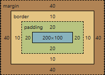
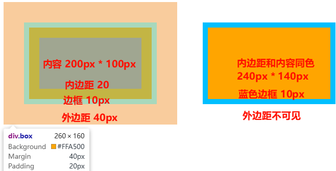

## Table of Contents

## 介绍

CSS(Cascading Style Sheets) 译为层叠样式表, 用以描述 HTML 元素的样式, 布局, 从而控制网页的外观

- 样式定义: 大小, 形状, 颜色, 字体
- 布局控制: 元素位置, 间隔, 排列方式
- 响应式设计: 根据不同设备或用户操作实现自适应布局和样式调整
- 层叠性: 多个样式同时作用一个元素, 按优先级别进行叠加覆盖

```html
<!-- HTML 元素自带样式  -->
<p style="color: red; font-size: 16px;">HTML 内联 CSS</p>

<!-- HTML 文件共用样式表 -->
<head>
  <!-- HTML 内部样式  -->
  <style>
    p {
      color: blue;
      font-size: 14px;
    }
  </style>
</head>

<!-- 引用外部 CSS 样式, href 指向 css 文件路径-->
<head>
  <link rel="stylesheet" href="styles.css" />
</head>
```

## 基本结构

## 选择器

修改样式需要使用选择器指定需要修改的 HTML 元素

### 通用选择器

`*` 表示选择所有元素, 常用于初始化元素属性, 统一元素属性

```css
/* 清楚元素默认的内外边距 */
* {
  margin: 0 auto;
  padding: 0;
}
```

### 标签选择器

标签选择器即使用 HTML 标签名作为选择器  
匹配所有同名的 HTML 元素  
权重低, 会被其它选择器覆盖

```html
<head>
    <style>
        /* 直接使用标签名 */
        div {
            color: blue;
        }
        p {
            color: red;
            font-size: 14px;
        }
    </style>
</head>

<main>
    <div>
        <p> content <p>
    <div>
</main>
```

### ID 选择器

ID 选择器用以选择带有 id 属性的元素  
单个元素只能有一个 id  
所有元素的 id 都必须不同

```html
<head>
    <style>
        /* # 开头表示 ID 选择器 */
        #title {
            color: blue;
            font-size: 14px;
        }
    </style>
</head>

<main>
    <div id="title">
        <p> title div <p>
    <div>
    <div id="content">
        <p> content div <p>
    <div>
</main>
```

### 类选择器

类选择器用以选择带有 class 属性的元素  
单个元素可以有多个类名  
多个元素可以使用相同的类名

```html
<head>
    <style>
        /* . 开头表示类选择器 */
        .div {
            color: blue;
        }
        .title {
            color: red;
        }
    </style>
</head>

<main>
    <div class="div title">
        <p> title div <p>
    <div>
    <div class="div content">
        <p> content div <p>
    <div>
</main>
```

```css
/* 类名为 title 的 div 标签 */
div.title {
  color: black;
}
```

### 后代选择器

```css
/* 后代选择, 具有 main div p 层叠结构的 p 标签 */
main div p {
  font-size: 14px;
}
```

## 伪类

伪类是一种用于选择元素的特殊关键字, 伪类可以通过状态或位置选择元素

| 伪类 | `:hover`         | `:first-child`       | `:nth-child(3)`       | `:last-child`          |
| :--: | :--------------- | :------------------- | :-------------------- | :--------------------- |
| 含义 | 鼠标悬停于元素时 | 父元素的第一个子元素 | 父元素的第 3 个子元素 | 父元素的最后一个子元素 |

```css
/* 类名为 static 的元素, 静态样式 */
.static {
  color: black;
  font-size: 14px;
}

/* 当鼠标悬停在元素上, 样式变更 */
.static:hover {
  color: red;
  font-size: 20px;
}

/* ul 或 ol 下第一个字元素样式 */
li:first-child {
  background-color: blue;
}

/* ul 或 ol 下第 2 个字元素样式(序号可以替换) */
li:nth-child(2) {
  background-color: green;
}

/* ul 或 ol 下最后一个字元素样式 */
li:last-child {
  background-color: yellow;
}
```

## 文本属性

font-family：用于指定文字的字体  
font-style：用于指定文字的样式, 例如 italic 或 normal

font-size：用于指定文字的大小  
font-weight：用于指定文字的粗细程度  
color：用于指定文字的颜色  
text-shadow: 文字阴影  
text-decoration: 文本装饰, none, underline(下划线), line-through(删除线)

text-align：用于指定文字的对齐方式，例如 left、center 或 right  
line-height: 行高, 行与行间的距离

### 水平位置

|  值  | `left`         | `right` | `center` | `justify` | `inherit`  |
| :--: | :------------- | :------ | :------- | :-------- | :--------- |
| 含义 | 左对齐(默认值) | 右对齐  | 居中对齐 | 两端对齐  | 继承父元素 |

```css
p {
  text-align: center;
}
```

## 盒模型

| 属性 | `padding`              | `border`       | `margin`               |
| :--: | :--------------------- | :------------- | :--------------------- |
| 描述 | 内边距(边框和内容距离) | 边框(边框厚度) | 外边距(边框与外部距离) |

标准盒模型 width, height 指定的是盒子内容大小, 实际占用大小需要加上, 边框, 内边距(不包含外边距)  
`box_width = width + 2*border + padding-left + padding-right`  
`box_height = height + 2*border + padding-top + padding-bottom`

```css
/* 盒子模型 */
.box {
  width: 200px;
  height: 100px;
  background-color: orange;
  border: 10px solid deepskyblue;
  padding: 20px;
  margin: 40px;
}
/* box width = width + 2 * border + 2 * padding = 200px + 2 * 10px + 2 * 20px = 260px */
/* box height = height + 2 * border + 2 * padding = 100px + 2 * 10px + 2 * 20px = 160px */
```




左边通过开发工具显示盒模型详细数据, 右边为正常网页渲染效果

橙色的盒子是内容区(500px \* 400px), 蓝色的边框是边框(10px), 棕色内边距占用空间(20px), 最外部粉色的外边距(40px)

## 定位

## 居中

## 属性顺序

布局相关属性：如 display、position、float、top、right、bottom、left 等  
盒模型相关属性：如 width、height、padding、margin、border 等  
排版相关属性：如 font、text-align、line-height、letter-spacing、word-spacing 等  
背景相关属性：如 background-color、background-image、background-size、background-position、background-repeat 等  
边框相关属性：如 border、border-radius 等  
其他属性：如 color、opacity、box-shadow、transition、animation 等
