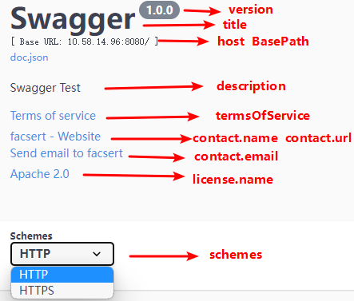

## Table of Contents

## 安装

下载 swagger 关联的库

```bash
 $ go get -u github.com/swaggo/swag/cmd/swag     # swag 命令行工具
 $ go get -u github.com/swaggo/gin-swagger
 $ go get -u github.com/swaggo/files

 $ go install github.com/swaggo/swag/cmd/swag    # 编译生产可执行文件放入$GOPATH/bin
 $ swag -v
 > swag version v1.8.12
```

添加注释并拉起服务后，浏览器访问 `http://<host>:<port>/swagger/index.html`

## 通用注解

go swagger 通过注释绑定接口设置和显示内容  
[Github swag](https://github.com/swaggo/swag)

```go
package main

import (
    "net/http"

    "github.com/gin-gonic/gin"                   // 引入 gin
    "github.com/swaggo/gin-swagger"              // gin-swagger middleware
    "github.com/swaggo/files"                    // swagger embed files

    _ "swag/docs"                                // <project>/docs  swag 为项目名
)

// @title           Swagger Example API
// @version         1.0
// @description     This is a sample server celler server.
// @termsOfService  http://swagger.io/terms/

// @contact.name    API Support
// @contact.url     http://www.swagger.io/support
// @contact.email   support@swagger.io

// @license.name    Apache 2.0
// @license.url     http://www.apache.org/licenses/LICENSE-2.0.html

// @host            localhost:8080
// @BasePath        /
// @schemes         http https
// @description     Swagger Test

// @securityDefinitions.basic  BasicAuth

// @contact.name    facsert
// @contact.url     https://facsert.github.io/
// @contact.email   facsert@outlook.com

// @externalDocs.description  OpenAPI
// @externalDocs.url          https://swagger.io/resources/open-api/
func main() {
    engine := gin.Default()
    engine.GET("/swagger/*any", ginSwagger.WrapHandler(swaggerFiles.Handler))
    engine.Run(":8080")
}
```



| 字段              | 说明                                  | 示例                                              |
| :---------------- | :------------------------------------ | :------------------------------------------------ |
| `@title`          | (必填)大标题                          | `Swagger`                                         |
| `@version`        | (必填)版本                            | `1.0.0`                                           |
| `@description`    | 描述                                  | `Swagger Test`                                    |
| `@host`           | 运行服务主机 IP 地址                  | `10.58.14.96:8080`                                |
| `@BasePath`       | API 基本路径(会添加在所有 API 路由前) | `/`                                               |
| `@schemes`        | 请求的传输协议                        | `http https`                                      |
| `@contact.name`   | 联系人信息                            | `facsert`                                         |
| `@contact.url`    | 联系人信息网址                        | `https://facsert.github.io/`                      |
| `@contact.email`  | 联系人邮件                            | `facsert@outlook.com`                             |
| `@termsOfService` | API 服务条款                          | `http://swagger.io/terms/`                        |
| `@license.name`   | (必填)API 许可证名称                  | `Apache 2.0`                                      |
| `@license.url`    | API 许可证网址                        | `http://www.apache.org/licenses/LICENSE-2.0.html` |

部分字段如 `@title` `@version` `@license.name` 是必填字段，字段首字母不区分大小写
其余字段可填，可不填写

## API 注解

```go
// @tags     Router
// @id       root
// @summary  "root page"
// @Produce  json
// @Success  200 {object} string "response with root page"
// @Failure  400 {object} string "response with root page fail"
// @Router   /  [get]
func webRoot(context *gin.Context) {
    context.String(http.StatusOK, "this is root page")
}
```

<!--  -->

| 字段        | 说明                   | 示例                                     |
| :---------- | :--------------------- | :--------------------------------------- |
| `@tags`     | 一组 API 的组名        | `User`                                   |
| `@id`       | API 唯一标识           | `root page`                              |
| `@summary`  | API 简短描述           | `show info`                              |
| `@Router`   | (必填)路由和请求方法   | `/root/user [get]`                       |
| `@Param`    | 接口参数               | `name path string true "username"`       |
| `@Accept`   | 请求体的 MIME 类型数据 | `json`                                   |
| `@Produce`  | 响应体的 MIME 类型数据 | `json`                                   |
| `@Success`  | 响应成功内容           | `200 {object} string "response success"` |
| `@Failure`  | 响应失败内容           | `400 {object} string "response fail"`    |
| `@Response` | 响应失败内容           | `500 {object} string "response fail"`    |

部分字段如 `@Router` 是必填字段，缺失则不显示，字段首字母不区分大小写
其余字段根据不同接口影响功能测试

### MIME 类型

`MIME` 类型即请求体和响应体的类型

```go
// @Accept  application/json                   请求体是 json 类型数据
// @Accept  application/xml                    请求体是 XML 格式数据
// @Accept  application/x-www-form-urlencoded  请求体是表单类型
// @Produce text/plain                         响应纯文本数据
// @Produce text/html                          响应 HTML 数据
// @Produce application/octet-stream           响应二进制流数据, 返回客户端需要下载的文件
```

### 响应

`@Response  {return Code}  {param type}  {date type} commit`

```go
// @Success 200     {array}  model.Account
// @Header  200     {string} Token "qwerty"
// @Failure 400,404 {object} httputil.HTTPError
// @Failure default {object} httputil.DefaultError
```

### 参数

`@Parma name locate type need description attribute` API 参数信息和约束

- name: 参数名
- locate: 参数位置（path, query, header, body 或 formData）
- type: 参数的数据类型(可以使用自定义类型)
- need: 是否必须
- description: 参数的描述
- attribute: 属性(选填), 根据类型可以限定最大最小值, 长度, 格式等

```go
// @Param userId   path     int    true "UserID"    minimum(0) minimum(9)
// @Param username query    string true "Username"  minLength(0) maxLength(9)
// @Param levle    path     int    true "Levle"     enums(1, 2, 3)
// @Param user     body     User   true "User"
// @Param file     formData file   true "File upload"
```

### 路由

`@Router path  [httpMethod]`

静态路由: 固定路由，不会发生改变

```go
func main() {
    ...
    engine.GET("/index/static", static)
    ...
}

// @Tags    User
// @summary static router
// @Router  /index/static  [get]
func static(c *gin.Context) {
    c.String(http.StatusOK, "static page")
}
```

动态路由: 路由中存在参数

```go
func main() {
    ...
    engine.GET("/index/:name/:attribute", detail)
    ...
}

// @Tags    User
// @summary user api
// @Param   name path string true "name"
// @Param   attribute path string true "attribute name"
// @Router  /index/{name}/{attribute}  [get]
func detail(c *gin.Context) {
    name := c.Param("name")
    attr := c.Param("attribute")
    c.String(http.StatusOK, "name:%s attribute:%s", name, attr)
}
```
