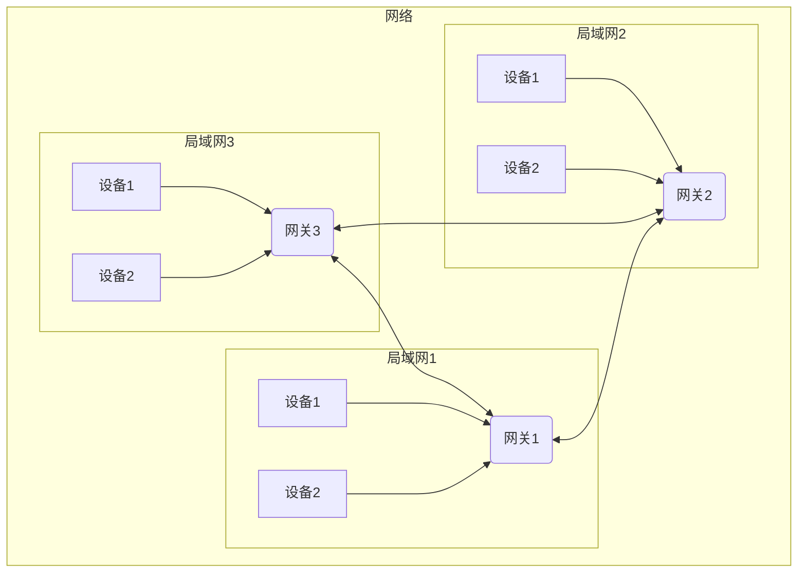

## 介绍

计算机网络是指将多个计算机连接在一起, 实现信息交换、资源共享和数据传输的计算机系统  
系统中网关给每一台机器分配一个 IP 地址, 同一网咯中的机器之间通过 IP 地址互相识别和通信  
不同网络的机器之间无法直接通信，需要通过路由器进行中转



## IP 地址

- IPV4: 32 位二进制(2^32), 通常转化为 4 组(一组0-255)10进制表示(256^4=2^32), 从 0.0.0.0 到 255.255.255.255, 地址已用尽
- IPV6: 128 位二进制(2^128), 通常用 8 组 4 位 16 进制(16^4^8=2^128), 0000:0000:00..(8组 32个0) 到 FFFF:FFFF:FF..(8组 32个F)

```bash
 # linux macos 查看 IP 地址
 $ ip a
 $ ifconfig

eth0: flags=4163<UP,BROADCAST,RUNNING,MULTICAST>  mtu 1500
        inet 172.31.239.107  netmask 255.255.240.0  broadcast 172.31.239.255
        inet6 fe80::215:5dff:fe0d:d89f  prefixlen 64  scopeid 0x20<link>
        ether 00:15:5d:0d:d8:9f  txqueuelen 1000  (Ethernet)
        RX packets 77958  bytes 50386965 (50.3 MB)
        RX errors 0  dropped 0  overruns 0  frame 0
        TX packets 39222  bytes 5389894 (5.3 MB)
        TX errors 0  dropped 0 overruns 0  carrier 0  collisions 0

lo: flags=73<UP,LOOPBACK,RUNNING>  mtu 65536
        inet 127.0.0.1  netmask 255.0.0.0
        inet6 ::1  prefixlen 128  scopeid 0x10<host>
        loop  txqueuelen 1000  (Local Loopback)
        RX packets 754324  bytes 666443571 (666.4 MB)
        RX errors 0  dropped 0  overruns 0  frame 0
        TX packets 754324  bytes 666443571 (666.4 MB)
        TX errors 0  dropped 0 overruns 0  carrier 0  collisions 0
 
 # windows 查看 IP 地址
 $ ipconfig

以太网适配器 以太网 2:

   连接特定的 DNS 后缀 . . . . . . . .: openstacklocal 
   IPv4 地址 . . . . . . . . . . . . : 10.1.1.15
   IPv6 地址 . . . . . . . . . . . . : fe80::42e:23ba:5f50:4232%16
   子网掩码  . . . . . . . . . . . . : 255.255.255.0
   默认网关. . . . . . . . . . . . . : 10.1.112.1

以太网适配器 vEthernet (WSL (Hyper-V firewall)):

   连接特定的 DNS 后缀 . . . . . . . :
   IPv4 地址 . . . . . . . . . . . . : 172.31.224.1
   子网掩码  . . . . . . . . . . . . : 255.255.240.0
   默认网关. . . . . . . . . . . . . :
```

## IPV6 格式

IPV6 有32字符, 为简便读写设定了一些压缩格式简写, 机器可以按规则补全恢复原有的 IPV6 地址

```bash
 # 一组 4 个字符或连续多组全为 0 简写为 ::(避免多种恢复结果, 一个IPV6地址只能出现 1 次)
 0000:0000:0000:0000:0000:0000:0000:0000 -> ::
 
 # 此种简写会导致补位出现多种情况, 所以不允许多个 ::
 0000:0000:0001:0000:0000:0001:0000:0000 -> ::0001::0001::

 # 16 进制中 00A0 = A0, 数字中前置的 0 不影响大小, 也适用于 IPV6
 0000:0000:0000:0001:0000:0000:0002:0000 -> ::1:0:0:2:0
```

## 子网掩码

为了对局域网下的设备进行分类, 设计了子网掩码对网段进行划分(如局域网下可用 IP 地址划分 3 组, 每组50个 IP 地址)  
因此, 网关在接到请求时, 可以通过使用子网掩码和目标 IP 按位与运算判断 IP 是否在子网, 是否要转发  

```bash
# C 类地址的子网掩码为 255.255.255.0, 最后 8 位用于分配, 3 组需要 2 位表示(2^2), 50 个 IP 地址需要 6 位(2^6)
# 子网掩码中 1 的位置表示网络部分(网段分组), 0 的位置表示主机部分(设备)
# 实际划分网段, 每个网段还必须要有网络地址(第一个)和广播地址(最后一个), 即每个网段 52 地址
# 最后可得子网掩码为 255.255.255.192
11111111.11111111.11111111.11000000 -> 255.255.255.192
A子网的网络地址：192.168.1.0/26, 可用地址（192.168.1.1～192.168.1.62）, 广播地址：192.168.1.63/26
B子网的网络地址：192.168.1.64/26, 可用地址（192.168.65～192.168.1.126）, 广播地址：192.168.1.127
C子网的网络地址：192.168.1.128/26, 可用地址（192.168.129～192.168.1.190）, 广播地址：192.168.1.191

# 子网掩码二进制中有 26 位为 1, 所以可以直接加在 IP 地址后一同表示  192.168.1.100/26
# 11111111.11111111.11111111.11000000 单纯从子网掩码可以得出划分了 3-4 组 IP, 每组最多 256/4 - 2 可用 IP

# A 子网 IP1 192.168.1.5 IP2 192.168.1.20 B 子网 IP3 192.168.1.70
# 通过和子网掩码计算可以得出 IP1 IP2 在同一个子网
IP1 192.168.1.5 & 255.255.255.192 = 192.168.1.0
IP2 192.168.1.20 & 255.255.255.192 = 192.168.1.0
IP3 192.168.1.70 & 255.255.255.192 = 192.168.1.64

# 一般家庭网络都为 C 类地址, 所以子网掩码一般为 255.255.255.0(即 1 个组)
# 网络地址(子网地址 netmask), 一般为第一个 IP 地址, 常为 192.168.1.0
# 网关(路由器地址 gateway), 一般为第一个可用 IP 地址, 常为 192.168.1.1
# 广播地址, 一般为最后一个 IP 地址, 常为 192.168.1.255
```
