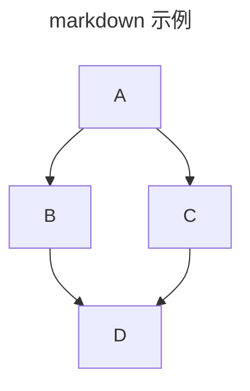
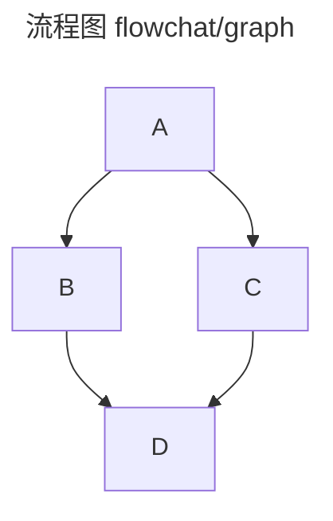
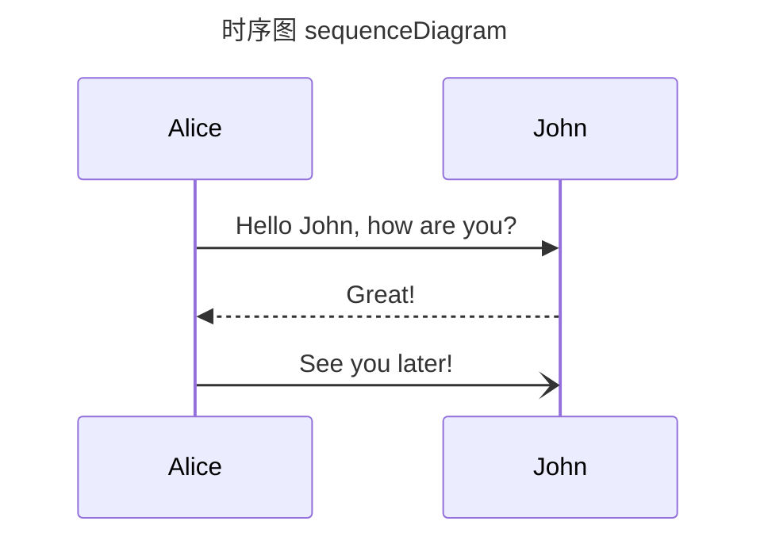
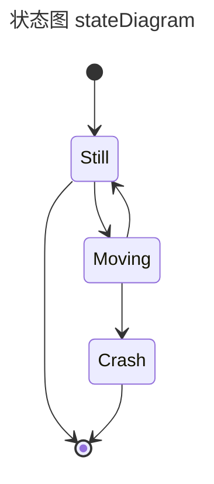
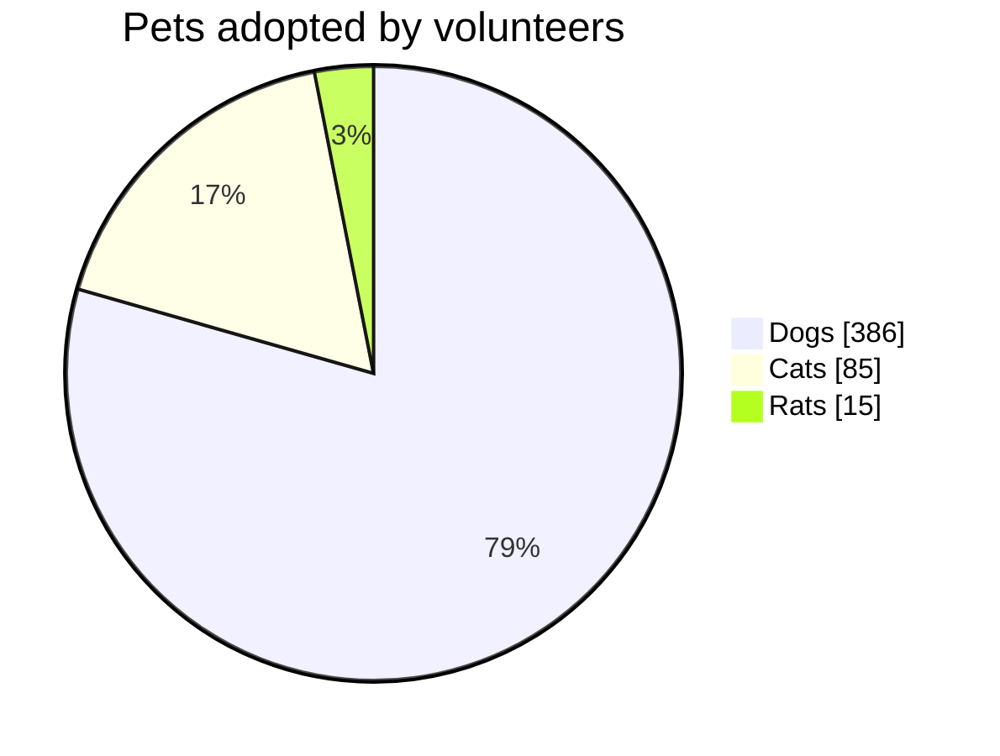
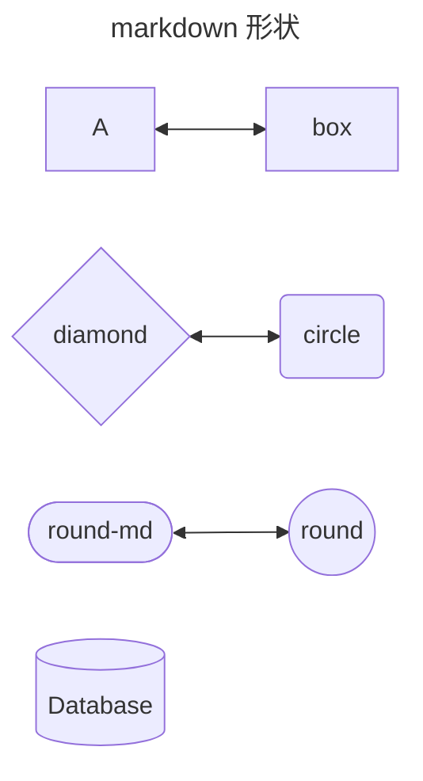
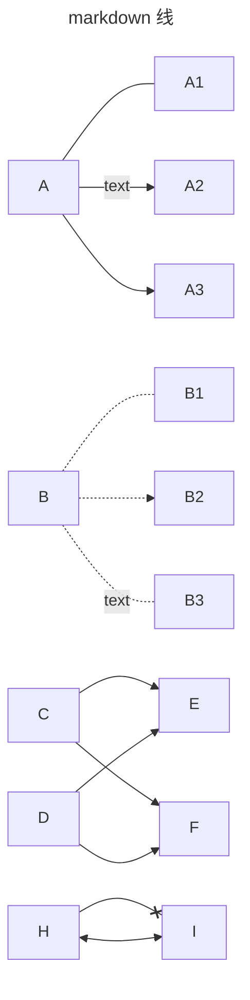

## Table of Contents

## 介绍

mermaid 是一个开源的图表和流程图生成工具，可以生成多种类型的图表  
mermaid 可以在 markdown 和 html 中使用  
[Mermaid 官网](https://mermaid.nodejs.cn/)



```html
<!-- html mermaid 示例 -->
<html>
  <body>
    Here is one mermaid diagram:
    <pre class="mermaid">
            graph TD 
            A --> B
            A --> C
            B --> D
            C --> D
    </pre>
    <script type="module">
      import mermaid from 'https://cdn.jsdelivr.net/npm/mermaid@10/dist/mermaid.esm.min.mjs';
      mermaid.initialize({ startOnLoad: true });
    </script>
  </body>
</html>
```

## 语法

### 图









### 图形



### 线


